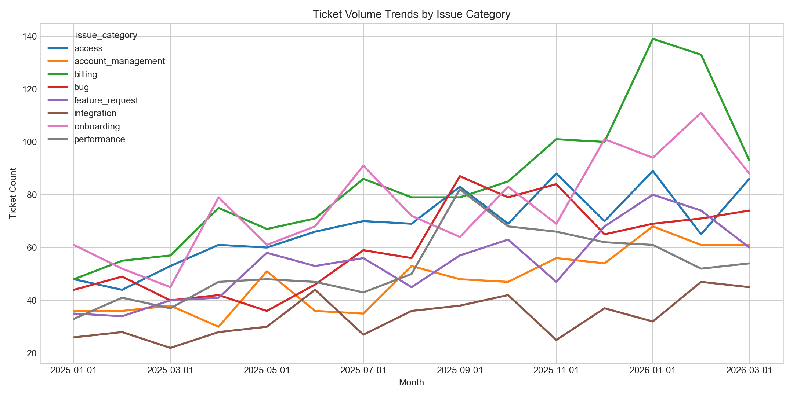
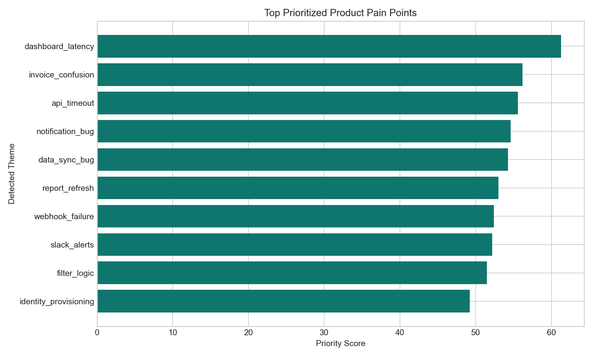

# AI Support Ticket Intelligence & Product Analytics

AI-enabled analytics project for SaaS support and product teams. This repo simulates how a B2B SaaS company could turn raw support demand into product insights, operational triage signals, and roadmap recommendations without building a chatbot or RAG assistant.

It is designed to be strong for both:
- Data Analyst / Product Analyst roles
- AI Product Manager / AI Product Analyst roles

## Why This Use Case Matters

Support tickets are one of the richest signals in a SaaS business. They capture product friction, onboarding gaps, billing confusion, reliability issues, and feature demand long before they show up in churn or NPS dashboards. The challenge is that support data is noisy, inconsistent, and spread across messages, accounts, and usage metrics.

This project turns that raw signal into a local decision-support workflow:
- generate believable SaaS support data
- classify and summarize support demand with an explainable local AI layer
- connect ticket pain to customer segments, ARR exposure, feature requests, and renewal risk
- surface what product and support teams should prioritize next

## Project Snapshot

- 320 synthetic SaaS accounts
- 1,564 synthetic users
- 7,148 tickets
- 22,924 ticket messages
- 333 feature requests
- 15 months of account history from January 2025 to March 2026
- 8 core tables in CSV + SQLite
- Streamlit app for local demo

## Key Features

- Realistic synthetic SaaS dataset with coherent account, ticket, usage, experiment, and renewal-risk signals
- SQL analysis pack for executive reporting and analyst workflows
- Local AI ticket classification into 8 support issue categories
- AI theme detection and weekly recurring pain-point summaries
- Explainable prioritization score combining volume, severity, CSAT drag, ARR exposure, churn risk, and feature-request pressure
- Dashboard-ready outputs and Streamlit demo app
- Product documentation, evaluation artifacts, and resume-ready storytelling

## Dataset Overview

Generated tables:
- `accounts`
- `users`
- `tickets`
- `ticket_messages`
- `product_usage`
- `feature_requests`
- `experiments`
- `monthly_account_metrics`

Built-in business logic includes:
- SMB accounts create more billing and onboarding demand
- Enterprise accounts create fewer tickets per account, but higher severity and higher renewal/churn risk
- performance and integration issues have the worst CSAT and longest resolution time
- billing confusion spikes around renewal season
- experiment variants influence support outcomes for targeted workflows

Full assumptions are documented in [docs/data_simulation_assumptions.md](docs/data_simulation_assumptions.md).

## AI Workflow

The AI layer is fully local and explainable:

1. Aggregate ticket messages into a customer-authored text view.
2. Apply a lightweight TF-IDF + logistic regression classifier to predict issue category.
3. Detect recurring ticket themes with transparent keyword rules.
4. Score ticket urgency and issue priority using operational and business signals.
5. Generate weekly summaries and ranked product pain points for analysts and PMs.

This project intentionally avoids chatbot UX and focuses on analytics, triage, prioritization, and decision support.

## Evaluation Snapshot

Classification was evaluated on a noisy, account-held-out test split to better reflect real support text variation.

- Accuracy: `0.938`
- Macro precision: `0.9263`
- Macro recall: `0.9303`
- Macro-F1: `0.9250`

Artifacts:
- `outputs/evaluation/classification_metrics.json`
- `outputs/evaluation/classification_confusion_matrix.csv`
- `outputs/evaluation/summarization_review_sheet.csv`
- `outputs/evaluation/prioritization_sanity_checks.csv`

## Current Findings

- `performance` has the worst CSAT (`2.48`) and highest average resolution time (`31.5h`)
- `integration` is the next riskiest category with average CSAT `2.56` and `34.6h` resolution time
- enterprise accounts have the highest churn-risk ticket rate (`18.2%`)
- `billing` grew fastest over the time window, up `128%` between early 2025 and early 2026
- `guided_onboarding` improved onboarding/access outcomes versus control
- top feature-request demand centers on `bulk_actions`, `custom_dashboard`, `audit_log`, and `advanced_permissions`

## Dashboard / Outputs

The Streamlit app includes:
- Executive Overview
- Issue Trends
- Segment Analysis
- Product Prioritization
- Experiment Analysis

Generated static visuals:





## Quickstart

```bash
python -m venv .venv
.venv\Scripts\activate
pip install -r requirements.txt
python scripts/run_pipeline.py
streamlit run app/streamlit_app.py
pytest -q
```

If you only want individual steps:

```bash
python scripts/generate_data.py
python scripts/run_analysis.py
python scripts/run_evaluation.py
```

## Repo Structure

```text
app/
  streamlit_app.py
data/
  raw/
  warehouse/
docs/
  analytics_spec.md
  data_simulation_assumptions.md
  evaluation_design.md
  experiment_ideas.md
  feature_prioritization.md
  launch_recommendation_memo.md
  prd.md
  resume_bullets.md
  success_metrics.md
  tracking_plan.md
  user_personas.md
  user_stories.md
outputs/
  evaluation/
  figures/
  models/
  sql/
  tables/
scripts/
  generate_data.py
  run_analysis.py
  run_evaluation.py
  run_pipeline.py
sql/
src/
tests/
README.md
requirements.txt
```

## Why This Project Works For Analytics Roles

For Data Analyst / Product Analyst roles:
- demonstrates SQL, pandas, metric design, segmentation, experiment analysis, and business recommendations
- shows how to connect support operations data with usage and revenue signals

For AI Product / AI PM roles:
- frames AI as a workflow and decision-support layer, not as a chatbot
- includes evaluation, tracking, prioritization logic, launch decisions, and product documentation

## Limitations

- data is synthetic, so external validity is illustrative rather than production-grade
- ticket text is generated from templates, even though noise and overlap were added
- summarization is rule-assisted and should be reviewed before executive use
- experiment analysis is directional rather than fully causal

## Next Steps

- add human-reviewed labels for a gold-standard triage set
- compare the baseline classifier to embeddings or LLM-assisted labeling
- expand prioritization to root-cause families and roadmap capacity constraints
- add dashboard filters for industry, tenure, and account health cohort
- incorporate SLA breach prediction and support staffing recommendations

